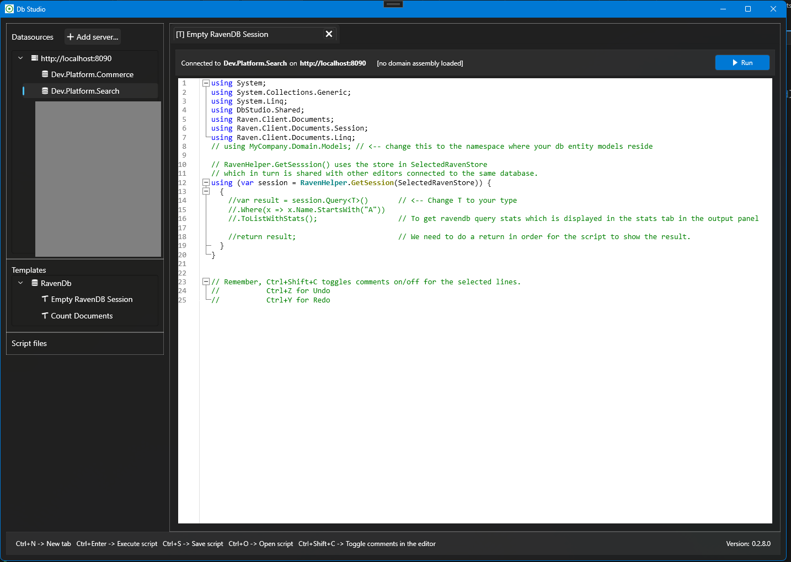

# 🧠 DbStudio

**DbStudio** is a fast, lightweight C# script editor for interacting with databases — starting with RavenDB.

Write and run C# scripts directly against your RavenDB (or other DBs in the future) using the power of [RoslynPad](https://github.com/aelij/RoslynPad) — in a clean, modern interface inspired by tools like SQL Management Studio.

> 💡 Ideal for power users and developers who want fast database access through C# scripting — no boilerplate, no build step.

---

## ✨ Features

- 🔌 Connect to multiple RavenDB servers (including secure cert-based ones)
- 📝 Edit and execute C# code in tabs with full Roslyn power
- 💾 Save/load `.csx` scripts
- 📂 Use script templates or create your own
- 🗂 Tree view for managing datasources, templates, and saved scripts
- 💡 Smart suggestions, syntax highlighting, and error feedback
- 🚀 Auto-updater with GitHub release integration

---

## 📸 Screenshots

> More screenshots coming soon

---

## 🛠 Installation

1. Go to the [Releases](https://github.com/moonstance/db-studio/releases) page
2. Download the latest `.zip` file
3. Extract it to a folder of your choice
4. Run `DbStudio.exe`

> ✅ No installation required — just unzip and go!

---

## ⚠ First-time Launch (Windows SmartScreen)

Since DbStudio is not yet code-signed, Windows may show a SmartScreen warning:

> "Windows protected your PC" – Publisher: Unknown

To run the app:

1. Click **More info**
2. Click **Run anyway**

The app is safe and open-source — you can [inspect the code here](https://github.com/moonstance/db-studio).

---

## 🧪 Roadmap

- [ ] Add support for MongoDB and SQL
- [ ] Improve script intellisense for custom assemblies
- [ ] UI enhancements and theming
- [ ] Cross-platform support?

Want to contribute or suggest features? [Open an issue](https://github.com/moonstance/db-studio/issues)!

---

## 🧬 Powered by

- The awesome [RoslynPad](https://github.com/aelij/RoslynPad)
- WPF + .NET 9
- RavenDB Client

---

## 📜 License

This project is licensed under **[GNU AFFERO GENERAL PUBLIC](LICENSE)**.  
Commercial use or redistribution with rebranding is not permitted without permission. (We'll define a clearer license soon.)

---

## 💬 Contact

Built by [@moonstance](https://github.com/moonstance)  
Feedback welcome — open an issue or discussion!
